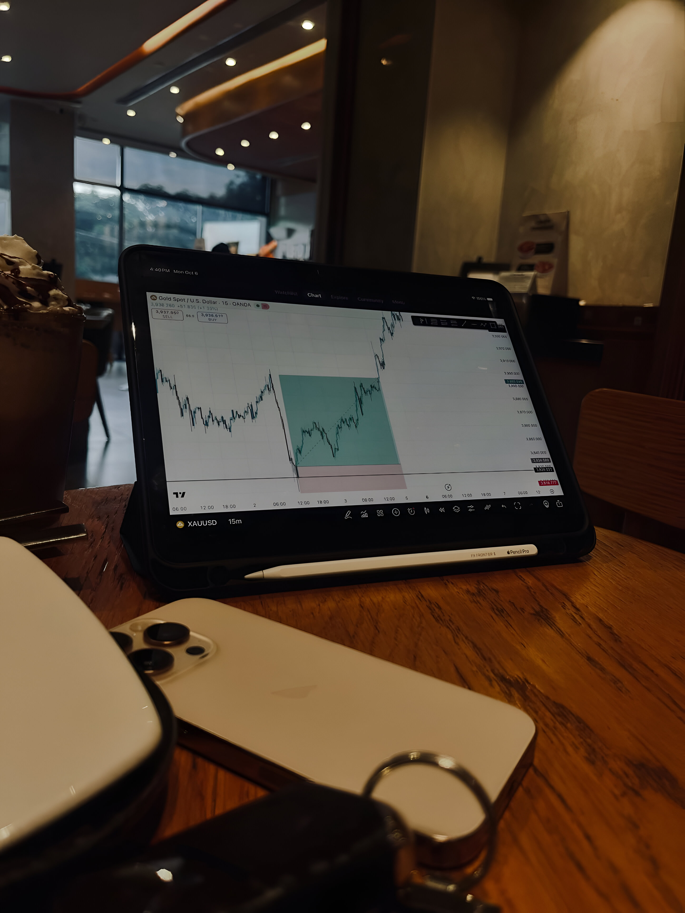

<html lang="sr">
<head>
  <meta charset="UTF-8">
  <title>Turski jezik i gramatika</title>
  <meta name="viewport" content="width=device-width, initial-scale=1.0">

  
</head>

<body>

<header>
  <h1>Turski jezik i gramatika</h1>
  
Forex Trading • GOLD (XAUUSD)

</header>

<section>

  <!-- O MENI -->
  

 <h2>O meni</h2>
  

    JokerFX je lični trading projekat nastao kao rezultat višegodišnjeg
    praktičnog iskustva na finansijskim tržištima, sa posebnim fokusom
    na Forex tržište i trgovanje zlatom (XAUUSD).
  

  

    Dolazim iz Srbije, Beograd, i aktivno se bavim trejdingom sa jasnim
    ciljem dugoročne konzistentnosti, kontrole rizika i profesionalnog
    pristupa tržištu. Moj stil trgovanja ne zasniva se na brzini ili
    prevelikom broju pozicija, već na strpljenju, analizi strukture
    tržišta i jasno definisanim pravilima.
  

  

    Fokus mog rada je na razumevanju market structure, ključnih nivoa
    ponude i potražnje, likvidnosti i ponašanja cene oko važnih zona.
    Najčešće analiziram tržište kroz više vremenskih okvira, sa glavnim
    naglaskom na D1, H4 i H1, što mi omogućava preciznije planiranje
    pozicija i realna očekivanja.
  

  

    Posebnu pažnju posvećujem upravljanju rizikom. Svaka pozicija ima
    unapred definisan stop loss, jasan plan izlaska i strogo ograničen
    rizik po trejdu. Smatram da je zaštita kapitala važnija od bilo koje
    pojedinačne prilike na tržištu.
  

  

    Ne trgujem tokom visokorizičnih makroekonomskih objava i izbegavam
    nepredvidive tržišne uslove. Disciplina, doslednost i psihološka
    stabilnost su temelji mog pristupa, jer verujem da uspeh u trejdingu
    dolazi kao rezultat procesa, a ne kratkoročnih dobitaka.
  

  

    Ovaj sajt predstavlja moj lični prostor za deljenje analize,
    razmišljanja i edukativnog sadržaja vezanog za Forex i GOLD trading.
    Sadržaj je informativnog i edukativnog karaktera i ne predstavlja
    finansijski savet.
      

    

    

      
      
      
    

  <!-- TRADING PHILOSOPHY -->
  

    <h2>Trading Philosophy</h2>
    

      Moj pristup trejdingu zasniva se na procesu, a ne na pojedinačnim
    rezultatima. Verujem da je dugoročna profitabilnost posledica
    discipline, ponovljivosti i pravilnog upravljanja rizikom, a ne
    agresivnog ili impulzivnog trgovanja.
  

  

    Tržište posmatram kao dinamičan sistem u kome cena reaguje na
    likvidnost, strukturu i kontekst viših vremenskih okvira. Ne jurim
    svaki pokret, već čekam jasno definisane situacije koje se uklapaju u
    moj plan i statističku prednost.
  

  

    Fokusiran sam na kvalitet, ne na kvantitet. Mali broj dobro
    isplaniranih trejdova ima veću vrednost od konstantnog izlaganja
    tržištu bez jasne ideje. Strpljenje smatram jednim od najvažnijih
    alata u trejdingu.
  

  

    Psihološka stabilnost i doslednost u izvršavanju plana su ključni
    elementi mog rada. Gubitak je deo procesa i prihvatam ga kao normalan
    trošak poslovanja, dok se uspeh meri kroz dugoročnu stabilnost
    rezultata.
  

  <!-- STRATEGIJA -->
  

    <h2>Strategija</h2>
    

 Moja strategija trgovanja zasniva se na kombinaciji analize viših
    vremenskih okvira, razumevanja strukture tržišta i strpljivog čekanja
    jasnih prilika. Fokus je isključivo na zlatnom paru (XAUUSD), koji
    pruža dovoljno volatilnosti i čiste tehničke strukture za planski
    trading.
  

  

    Analizu uvek započinjem na višim timeframe-ovima (D1 i H4), gde
    identifikujem glavni trend, ključne zone ponude i potražnje, kao i
    važne nivoe likvidnosti. Ovi nivoi predstavljaju osnovu mog bias-a i
    određuju u kom pravcu tražim prilike.
  

  

    Niži timeframe (H1) koristim isključivo za preciznije planiranje
    ulaska, potvrdu strukture i kontrolu rizika. Ne ulazim u pozicije bez
    jasnog konteksta sa viših vremenskih okvira, čime izbegavam impulsivne
    i niskokvalitetne trejdove.
  

  

    Strategija je prilagođena swing i intraday pristupu, sa jasno
    definisanim ciljevima i realnim očekivanjima. Ne jurim vrhove i dna,
    već se fokusiram na sredinu pokreta i nastavak već formirane
    strukture.
  

  

    Trgovanje tokom visokouticajnih ekonomskih vesti je svesno izostavljeno
    iz mog plana, jer smatram da takvi uslovi povećavaju nepredvidivost i
    narušavaju kvalitet statističke prednosti.
  

  

    Cilj strategije nije maksimalan profit u kratkom roku, već dugoročna
    stabilnost, ponovljivost i konzistentni rezultati kroz disciplinovano
    sprovođenje plana.
    

  

  <!-- ENTRY CONDITIONS -->
  

    <h2>Entry Conditions</h2>
    

      Ulazak u poziciju razmatram isključivo kada su ispunjeni jasno
    definisani uslovi sa viših vremenskih okvira. Ne trgujem nasumične
    pokrete cene niti ulazim bez prethodno formiranog bias-a.
  

  

    Prvi uslov je jasan kontekst sa D1 i H4 vremenskog okvira, uključujući
    trend, strukturu i reakciju cene na ključne zone. Bez tog konteksta,
    ne tražim prilike na nižim timeframe-ovima.
  

  

    Ulazak planiram tek nakon što cena dođe u unapred definisanu zonu
    interesa i pokaže znakove poštovanja strukture. H1 timeframe koristim
    za potvrdu, a ne za generisanje ideja.
  

  

    Ne koristim indikatore kao primarni signal. Fokus je na čistoj ceni,
    strukturi tržišta i ponašanju likvidnosti oko važnih nivoa.
    

  

  <!-- TRADE MANAGEMENT -->
  

    <h2>Trade Management</h2>
    

      Svaki trejd ima unapred definisan plan upravljanja, uključujući stop
    loss, cilj i očekivani odnos rizika i dobiti. Ne pomeram stop loss iz
    emotivnih razloga i ne improvizujem tokom trajanja pozicije.
  

  

    Stop loss postavljam na logičnom tehničkom nivou, tamo gde je ideja
    trejda invalidirana. Ciljevi su zasnovani na strukturi tržišta i
    potencijalnim zonama likvidnosti, a ne na proizvoljnim pipovima.
  

  

    Kada tržište potvrdi kretanje u željenom pravcu, fokusiram se na
    očuvanje kapitala i smanjenje rizika, umesto agresivnog povećavanja
    izloženosti.
  

  

    Cilj nije maksimalno “iscijeđen” trejd, već disciplinovano sproveden
    plan sa realnim očekivanjima.
    

  

  
  <!-- WHAT I DON'T TRADE -->
  

    <h2>What I Don’t Trade</h2>
    Jednako je važno znati kada ne trgovati kao i kada ući u poziciju.
    Veliki deo mog edge-a dolazi upravo iz izbegavanja loših uslova.
  

  <ul>
    <li>Ne trgujem tokom visokouticajnih ekonomskih vesti.</li>
    <li>Ne ulazim u pozicije bez jasnog konteksta sa viših timeframe-ova.</li>
    <li>Ne trgujem tržište koje je u haotičnoj ili nečitljivoj strukturi.</li>
    <li>Ne forsiram trejdove zbog dosade ili želje za akcijom.</li>
    <li>Ne povećavam rizik nakon gubitničkih pozicija.</li>
  </ul>

  

    Ovi filteri mi omogućavaju da zadržim fokus, disciplinu i dugoročnu
    stabilnost u pristupu tržištu.
  

  <!-- WEEKLY GOLD BIAS -->
  

    <h2>Weekly GOLD Bias (XAUUSD)</h2>
    

     Ova sekcija predstavlja moj nedeljni market bias za zlato (XAUUSD),
    zasnovan na analizi viših vremenskih okvira (D1 i H4). Cilj nije davanje
    konkretnih signala, već sagledavanje tržišnog konteksta, potencijalnih
    scenarija i ključnih nivoa.
  

  

    Bias se ažurira jednom nedeljno i služi kao okvir za razmišljanje,
    a ne kao poziv na akciju.
    </em>

  

  <!-- RISK MANAGEMENT -->
  

    <h2>Risk Management</h2>
    

  Upravljanje rizikom predstavlja najvažniji deo mog trading procesa.
    Bez obzira na kvalitet analize ili potencijalnu priliku, zaštita
    kapitala ima apsolutni prioritet.
  

  

    Rizik po pojedinačnom trejdu je striktno ograničen i unapred definisan.
    Ne povećavam rizik kako bih „nadoknadio“ gubitke i ne prilagođavam
    veličinu pozicije na osnovu emocija ili prethodnih rezultata.
  

  

    Svaka pozicija ima jasan stop loss postavljen na tehnički smislenom
    nivou, gde je ideja trejda invalidirana. Ukoliko tržište dođe do tog
    nivoa, trejd se smatra neuspešnim bez dodatnog razmišljanja ili
    intervencije.
  

  

    Fokus je na dugoročnoj stabilnosti i konzistentnosti, a ne na
    kratkoročnim dobitcima. Serija gubitaka se tretira kao normalan deo
    statističkog procesa, dok se uspeh meri disciplinom i doslednim
    sprovođenjem plana.
  

  

    Ne koristim martingale, grid sisteme niti agresivne tehnike povećanja
    izloženosti. Jednostavna pravila i kontrolisan rizik su temelj mog
    pristupa.
    

  

  <!-- MARKET ANALYSIS BUTTON -->
  

    <h2>Market Analysis</h2>
    

      Detaljnije nedeljne analize zlata (XAUUSD) dostupne su na posebnoj
      stranici.
    

    <a href="analysis.html" style="
      display:inline-block;
      margin-top:15px;
      padding:15px 35px;
      background:#facc15;
      color:#020617;
      font-weight:bold;
      border-radius:8px;
      text-decoration:none;
      font-size:16px;
    ">
      View Weekly Analysis
    </a>
  

  <!-- DISCLAIMER -->
  

    <h2>Napomena</h2>
    

      Sadržaj na ovom sajtu je edukativnog karaktera i ne predstavlja
      finansijski savet.
    

  

</section>

<!-- LIVE MARKET SESSION CLOCK -->

  
Market Sessions

  
New York 

  
London 

  
Tokyo 

</body>
</html>
